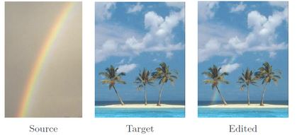

# CV_Image_blending
Image Blending project

This project is written in MATLAB 2018a. All project developement is explained in the jupyter notebook.

To make jupyter work with matlab you must install the matlab-kernel that can be found [here](https://pypi.org/project/matlab-kernel/)

The goal of this projec is to blend two images into one using mixing gradient poisson technique. The following image illustrates the idea:

